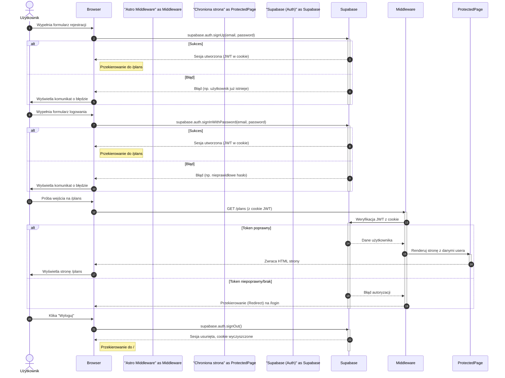

<architecture_analysis>
Na podstawie dostarczonych dokumentów (`prd.md`, `auth-spec.md`) oraz analizy kodu, zidentyfikowano kluczowe elementy architektury UI dla modułu autentykacji.

### 1. Wypis komponentów i stron

#### Nowe Strony:

- **`/login`**: Strona publiczna renderująca formularz logowania.
- **`/register`**: Strona publiczna renderująca formularz rejestracji.
- **`/forgot-password`**: Strona publiczna do inicjowania resetu hasła.
- **`/update-password`**: Strona publiczna do ustawiania nowego hasła po resecie.

#### Modyfikowane Strony i Layouty:

- **`src/layouts/MainLayout.astro`**: Główny layout aplikacji. Zostanie zaktualizowany, aby warunkowo wyświetlać linki "Zaloguj" / "Zarejestruj" dla gości lub komponent `UserMenu` dla zalogowanych użytkowników.
- **`src/pages/plans.astro`**: Strona główna z planami. Dostęp zostanie ograniczony tylko dla zalogowanych użytkowników.
- **`src/pages/profile.astro`**: Strona profilu. Dostęp zostanie ograniczony tylko dla zalogowanych użytkowników.

#### Nowe Komponenty:

- **`AuthForm.tsx`**: Klientowski komponent React do obsługi formularzy logowania i rejestracji, włączając walidację (zod, react-hook-form) i komunikację z Supabase.
- **`GoogleAuthButton.tsx`**: Przycisk do logowania za pomocą Google OAuth.
- **`UserMenu.tsx`**: Dropdown menu w nagłówku dla zalogowanych użytkowników, zawierający link do profilu i przycisk wylogowania.

#### Modyfikowane Komponenty:

- **`PlansDashboard.tsx`**: Komponent zostanie uproszczony – usunięty zostanie z niego przycisk "Profil", ponieważ ta funkcjonalność zostanie przeniesiona do globalnego `UserMenu.tsx`.

### 2. Główne strony i ich komponenty

- **Strona `/login`**: Będzie renderować komponent `AuthForm.tsx` (w trybie logowania) oraz `GoogleAuthButton.tsx`.
- **Strona `/register`**: Będzie renderować `AuthForm.tsx` (w trybie rejestracji) oraz `GoogleAuthButton.tsx`.
- **Layout `MainLayout.astro`**: Będzie zawierać logikę do wyświetlania `UserMenu.tsx` w miejscu standardowych przycisków nawigacyjnych, gdy użytkownik jest zalogowany.

### 3. Przepływ danych

1.  Użytkownik (niezalogowany) wchodzi na stronę chronioną (np. `/plans`).
2.  **Middleware (`src/middleware/index.ts`)** przechwytuje żądanie, sprawdza brak aktywnej sesji i przekierowuje użytkownika na stronę `/login`.
3.  Na stronie `/login`, komponent **`AuthForm.tsx`** komunikuje się po stronie klienta z **Supabase JS SDK**, wywołując `signInWithPassword()` lub `signUp()`.
4.  Po pomyślnym uwierzytelnieniu, Supabase SDK zapisuje sesję w ciasteczkach, a aplikacja przekierowuje użytkownika na docelową stronę (np. `/plans`).
5.  Teraz, dla zalogowanego użytkownika, **`MainLayout.astro`** renderuje komponent **`UserMenu.tsx`**.
6.  Kliknięcie "Wyloguj" w **`UserMenu.tsx`** wywołuje `signOut()`, usuwa sesję, a middleware przy następnym żądaniu do strony chronionej ponownie przekieruje na `/login`.

### 4. Opis funkcjonalności komponentów

- **`MainLayout.astro`**: Centralny punkt layoutu aplikacji. Odpowiada za renderowanie odpowiednich elementów nawigacji w zależności od statusu uwierzytelnienia użytkownika.
- **`AuthForm.tsx`**: Sercem interakcji logowania/rejestracji. Zarządza stanem formularza, walidacją w czasie rzeczywistym i obsługą błędów z Supabase.
- **`GoogleAuthButton.tsx`**: Upraszcza logowanie, inicjując przepływ OAuth jednym kliknięciem.
- **`UserMenu.tsx`**: Poprawia UX dla zalogowanych użytkowników, dając im stały i łatwy dostęp do profilu i opcji wylogowania.
- **`Middleware`**: Działa jako strażnik aplikacji, zabezpieczając chronione zasoby i przekierowując niezalogowanych użytkowników.

</architecture_analysis>

